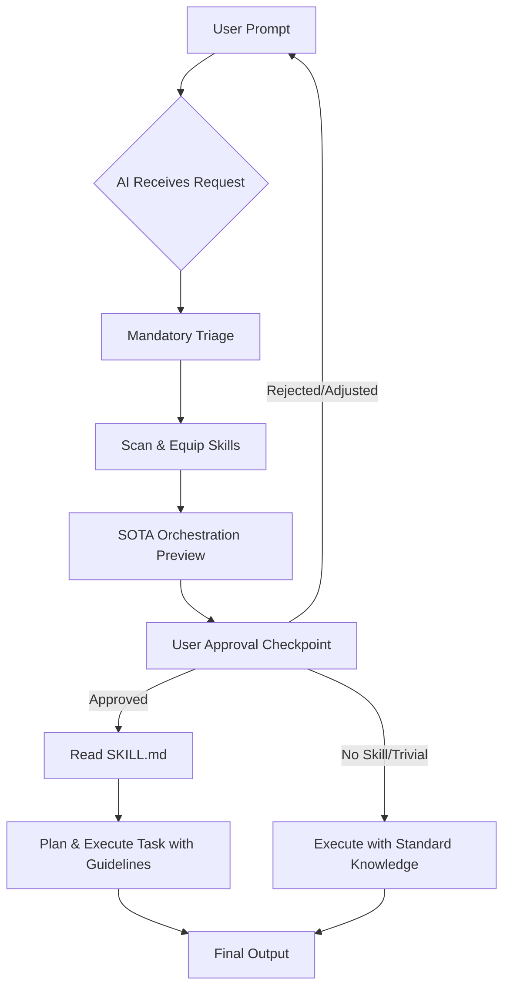

# Smart Orchestrator: Autonomous AI Skill Triage & Routing

[](https://opensource.org/licenses/MIT)
[](http://makeapullrequest.com)


Welcome to the **Smart Orchestrator** pattern for AI-assisted development. This project defines a structural methodology to turn standard AI coding assistants (like Claude, Antigravity, Cursor) into **"Smart Orchestrators"** that automatically select, load, and execute specialized skills based on the user's prompt.

## 🚀 The Problem

Modern AI assistants have access to powerful, specialized tools (skills) and documentation (e.g., UI/UX best practices, advanced database architectures, E2E testing guides). However, users typically have to manually instruct the AI to use these specific tools. Without explicit instruction, the AI defaults to generic code generation, leading to sub-optimal, non-standardized results.

## 💡 The Solution: Auto-Mechanism

The **Auto-Mechanism (Skill Triage)** is a mandatory protocol injected into the system prompt (e.g., `AGENTS.md`, `GEMINI.md`). It forces the AI to pause before writing code and run a background analysis on the request.

### Core Principles

1. **Mandatory Triage:** Never start coding immediately upon receiving a complex prompt.
2. **Equip Skills:** Scan the available `<skills>` repository. Identify 1-3 specific skills (e.g., `ui-ux-pro-max`, `postgres-patterns`) that fit the task.
3. **Read & Execute:** Autonomously read the documentation (`SKILL.md`) for the chosen skills using file-reading tools, and strictly apply those industry standards to the solution.
4. **Transparent SOTA Orchestration Preview:** For critical/complex tasks, generate a transparent pre-flight report mapping risk, equipped skills, blast radius mapping, proactive value-adds, and an advanced technical prompt, obtaining explicit user approval before planning/execution.

### Architecture Flow



## 🧠 How It Works Under the Hood

Smart Orchestrator implements a highly efficient, event-driven autonomous workflow that prevents instruction bloat and ensures high-quality deliverables:

1. **Analysis & Triage (RFC Phase):** When a user sends a prompt, the AI stops. It parses the request to determine if it is trivial (simple fix) or complex (requires planning).
2. **Dynamic Context Pruning:** Rather than loading all engineering instructions into the system prompt (which dilutes model attention and wastes tokens), the AI scans `.skills/*/SKILL.md` metadata and dynamically reads *only* the specific expert skill sheets required for the task.
3. **Blast Radius Blueprinting:** The AI diagrams the structural changes across all codebases (API, UI, Database) and gauges risk levels (Low/Medium/High) along with rollback actions.
4. **HITL (Human-in-the-Loop) Gateway:** The AI presents this blueprint to the developer as a SOTA Triage Preview. Coding only begins once the developer grants approval.
5. **Execution & Self-Improvement:** The AI executes the changes. If it makes a mistake or gets corrected, it logs the pattern into `tasks/lessons.md` to prevent recurring regressions.

---

## 💎 Core Benefits

*   **⚡ 90% Context Token Savings:** Dynamically pruning irrelevant instructions keeps the context window lightweight and extremely focused.
*   **🛡️ Asymmetric Risk Mitigation:** Visualizing the **Blast Radius Mapping** and preparing a **Rollback Plan** prevents production crashes *before* writing a single line of code.
*   **🎨 Senior-Level Aesthetics by Default:** Forces AI to bypass lazy browser defaults and apply harmonized color grids, micro-animations, and error boundaries.
*   **💾 Zero Instruction Decay:** The zero-dependency linter (`npm run lint:skills`) integrates into CI/CD pipelines to ensure team-written skills remain perfectly structured.

---

## 🎬 Real-World Case Studies (Before vs. After)

### 📊 Example 1: Frontend Component Development

#### 1. 🛑 Vague User Prompt
> "Build a responsive product cart card component."

#### 2. ❌ Result *Without* Smart Orchestrator
The AI instantly outputs a generic, flat HTML snippet with plain CSS, browser-default images, and missing error boundary isolates. It looks boring, basic, and breaks if data is missing.

#### 3. 🎯 SOTA Triage Preview *With* Smart Orchestrator
```markdown
### 🔍 Auto-Mechanism & Skill Triage Report

#### 🚦 Risk & Confidence Scoring
*   **Risk Level:** Low
*   **Rationale:** Modifies only the UI layer and introduces an isolated React component.
*   **Rollback Plan:** Discard modifications and revert to the backup of `src/components/ProductCard.tsx`.

#### 🛡️ 1. Equipped Skills
- `frontend-ui-ux-pro` (Premium typography, glassmorphism UI, responsive grids).

#### 🗺️ 2. Blast Radius Map
| Affected Layer | File / Table Path | Impact Type | Potential Side Effects |
| :--- | :--- | :--- | :--- |
| **Frontend UI** | `src/components/ProductCard.tsx` | Create | None (Isolated new component) |

#### 📝 3. Active Architectural Rules
- **Frontend Performance (Rule 13):** Next.js default `next/image` is forbidden; use custom `CustomImage.tsx` supporting Cloudflare CDN proxy.
- **UI Isolation (Rule 13):** Integrate loading skeletons and React Error Boundaries.

#### 🚀 4. Proactive / Value-Add Recommendations
- **Aesthetic:** Let's add a 4px `backdrop-filter: blur(10px)` glassmorphism effect on hover state accompanied by smooth micro-animations.

#### 🧠 5. Advanced Orchestrated Prompt
- Create a premium React product card component with `CustomImage` integration, a loading skeleton, optimistic state updates, wrapped in a React Error Boundary, using Tailwind HSL colors and an 8pt grid system.
```

#### 4. ✨ Resulting Output (Premium Senior-Level UI)
The AI outputs a gorgeous, glassmorphic component with lazy-loading skeletons, responsive layouts, Cloudflare CDN optimizations, and smooth Framer Motion micro-animations:
```tsx
import React from 'react';
import { CustomImage } from './CustomImage'; // CDN Optimized
import { motion } from 'framer-motion';

export const ProductCard = ({ product }) => {
  return (
    <motion.div 
      whileHover={{ scale: 1.02 }}
      className="bg-white/10 backdrop-blur-md border border-white/20 rounded-2xl p-4 shadow-xl shrink-0"
    >
      <div className="relative overflow-hidden rounded-xl aspect-square">
        <CustomImage src={product.image} alt={product.name} fill className="object-cover" />
      </div>
      <h3 className="font-outfit text-white text-lg mt-3 font-semibold">{product.name}</h3>
      <p className="text-white/60 text-sm mt-1">{product.description}</p>
      <div className="flex items-center justify-between mt-4">
        <span className="font-bold text-white text-xl">${product.price}</span>
        <button className="bg-gradient-to-r from-purple-500 to-indigo-600 hover:shadow-purple-500/20 text-white font-medium px-4 py-2 rounded-lg transition-all duration-300">
          Add to Cart
        </button>
      </div>
    </motion.div>
  );
};
```

---

### 🗄️ Example 2: Database Schema & Migration

#### 1. 🛑 Vague User Prompt
> "Add a wallet balance to our user schema."

#### 2. ❌ Result *Without* Smart Orchestrator
The AI blindly modifies the Prisma schema, making the new field required without a default value, and runs a migration directly. When pushed to production, **the database locks**, and the site crashes because existing users have no default wallet balance.

#### 🎯 3. SOTA Triage Preview *With* Smart Orchestrator
```markdown
### 🔍 Auto-Mechanism & Skill Triage Report

#### 🚦 Risk & Confidence Scoring
*   **Risk Level:** High
*   **Rationale:** Includes database schema changes, which can trigger data loss or table locks in production.
*   **Rollback Plan:** Take a Postgres dump using `pnpm db:backup` before running the migration. Revert the database and restore the schema on failure.

#### 🛡️ 1. Equipped Skills
- `backend-clean-architecture` (Zero-downtime, migration safety, ORM patterns).

#### 🗺️ 2. Blast Radius Map
| Affected Layer | File / Table Path | Impact Type | Potential Side Effects |
| :--- | :--- | :--- | :--- |
| **Database** | `prisma/schema.prisma` | Modify | Data incompatibility could occur on existing rows in production. |
| **Backend API** | `user.service.js` | Modify | Requisite null checks must be placed on wallet fields in backend. |

#### 📝 3. Active Architectural Rules
- **Database Schema (Rule 4):** Backward-compatibility breaking destructive migrations are forbidden. Fields must be nullable or possess default values (e.g. default: 0).
- **Database Backup (Rule 10):** Taking a backup with `pnpm db:backup` is strictly mandatory before running any migration.

#### 🚀 4. Proactive / Value-Add Recommendations
- Wallet balance should be handled in cents. To avoid precision errors, we suggest using `Int` (in cents) or `Decimal` rather than floating-point fields.

#### 🧠 5. Advanced Orchestrated Prompt
- Safely add `balance` as an Int (representing cents) with a default value of 0 (default: 0) to the Prisma `User` model. Sequentialize database backup via `pnpm db:backup` and a zero-downtime migration approach.
```

#### 4. ✨ Resulting Output (Flawless Safe Database Migration)
The AI guides the user to safely take a database dump, adds the new field in a fully backward-compatible way, generates migration scripts, and updates ORM layers without any downtime or database lock risks:
```prisma
// packages/database/prisma/schema.prisma
model User {
  id        String   @id @default(uuid())
  email     String   @unique
  name      String?
  // Added safely with default value of 0 (cents) to prevent null failures on existing rows
  balance   Int      @default(0) 
  createdAt DateTime @default(now())
  updatedAt DateTime @updatedAt
}
```

---

## 📚 Standard Library Included

To make `smart-orchestrator` instantly useful across any sector, we have included a comprehensive "Standard Library" of `SKILL.md` examples. These cover best practices and industry standards for various domains:

- **🎨 Frontend & UI/UX** (`examples/frontend-ui-ux-pro`)
- **⚙️ Backend Clean Architecture** (`examples/backend-clean-architecture`)
- **🛡️ Cybersecurity (OWASP)** (`examples/security-owasp-top10`)
- **☁️ DevOps & Cloud** (`examples/devops-cloud-architect`)
- **📊 Data Science & ML** (`examples/data-science-and-ml`)
- **🧪 QA & E2E Testing** (`examples/qa-e2e-testing`)
- **📱 Mobile-First Patterns** (`examples/mobile-first-patterns`)

You can copy any of these templates into your project's `.skills/` or `skills/` directory to instantly elevate your AI's domain expertise.

## ⚡ Interactive CLI & Skill Linter (New in 2.3)

Smart Orchestrator 2.3 includes a zero-dependency interactive/silent setup wizard and a CI/CD linter to maintain structural discipline.

### 1. Interactive & Silent CLI Wizard
Instantly initialize and customize the triage blueprint according to your project's technical stack and target AI IDEs:
```bash
# Run the interactive setup directly from GitHub (Zero-friction)
npx -y github:ahmetbolu/smart-orchestrator init

# Or bootstrap instantly in 1 second with optimal smart defaults (Silent Mode)
npx -y github:ahmetbolu/smart-orchestrator init -y
```

#### Key 2.3 CLI Capabilities

* **🌍 Premium Guidelines:** Scaffolds industry-standard AI guidelines and rules in **English** with full support for modern AI models.
* **🎯 Multi-IDE Directives Generation:** Instantly creates specialized configuration files for your preferred tools:
  * `AGENTS.md` (Unified cognitive instructions)
  * `.cursorrules` (Fully configured file for Cursor IDE)
  * `.windsurfrules` (Directives for Windsurf IDE)
  * `CLAUDE.md` (Optimized guidelines for Claude Code CLI)
  * `.vscode/settings.json` (Custom Copilot instructions integration)
* **📚 Standard Library Scaffolding:** Interactively selects or silently copies the 8 premium skill templates (e.g. `frontend-ui-ux-pro`, `backend-clean-architecture`, etc.) directly into your workspace `.skills/` folder.
* **🔄 Auto-Scaffold Support Blueprints:**
  * Automatically creates the `tasks/lessons.md` stub for the self-improvement lessons loop.
  * Automatically creates the `docs/architecture/MAP.md` stub mapping your cognitive repository map.

### 2. CI/CD Skill Linter
Enforce formatting discipline across all `.skills/*/SKILL.md` documents. The linter validates YAML frontmatter formatting, description completeness, and structural headings (H1/H2).
```bash
# Lint your local skills folder
pnpm run lint:skills
# or
node bin/lint.js
```
Perfect for automated CI/CD checks to prevent instruction decay over time.

## 🛠 Integration Guide

To implement this in your own AI-powered projects, simply add the following protocol to your main AI instruction file (e.g., `CLAUDE.md`, `AGENTS.md`, or `cursorrules`):

```markdown
## Autonomous Skill Triage & Routing (Auto-Mechanism & Skill Triage 2.2)
As an AI assistant in this project, you are not just a "code writer," but a **"Smart Orchestrator"** operating with maximum structural rigor.
1. **Mandatory Triage:** When you receive a new, complex, or ambiguous prompt from the user, DO NOT START WRITING CODE OR PLANNING DIRECTLY.
2. **Equip Skills & Dynamic Context Pruning:** First, scan the system's `.skills/` directory. Determine the most appropriate skills for the requested task. To keep your context window highly focused, only read the `SKILL.md` files of direct or immediately related skills. Avoid loading irrelevant skills.
3. **Read and Execute:** Use your file reading tools to read the `SKILL.md` files of the determined skills and perform the task adhering completely to the best industry standards, guidelines, and best practices found within. This step cannot be skipped.
4. **Transparent Triage & SOTA Orchestration Preview:** *For any critical, complex, or ambiguous task, before moving to the planning or coding phase*, you MUST present a transparent orchestration preview report to the user using the following template:
   - **Risk & Confidence Scoring:** The risk level of the task (Low/Medium/High), the reasoning behind it, and a **Rollback Plan** in case of failure.
   - **Equipped Skills:** The list of specific `<skills>` selected for the task and the rationale for their use.
   - **Blast Radius Mapping:** A table showing the components affected by the change (e.g., Database, API Backend, Frontend UI), the specific file paths, and potential side effects.
   - **Active Architectural Rules:** The active project guidelines directly affecting this task.
   - **Proactive / Value-Add Recommendations:** Optional or bonus suggestions (such as security enhancements, performance tuning, or fallback mechanisms) that the user might have missed but are industry standards.
   - **Advanced Orchestrated Prompt:** A technically enriched, precise reformulation of the user's initial prompt, complete with architectural constraints, input/output contracts, and E2E test scenarios.
   - **Approval Checkpoint:** Ask the user to review and explicitly approve this orchestration framework. You must wait for the user's approval before proceeding to planning and execution. This checkpoint is mandatory and cannot be bypassed.
5. **Self-Improvement / Lessons Loop:**
   - Always check `tasks/lessons.md` before starting a task to identify previously documented error patterns and coding constraints in this repository.
   - When resolving any bug or when corrected by the user, immediately document the mistake pattern and corresponding solution inside `tasks/lessons.md` to prevent recurring errors.
6. **Skills Quality Check (CI/CD Linter):**
   - Ensure all skills in `.skills/` match the structural standards by running `npm run lint:skills` (or `pnpm run lint:skills`). All skills must have valid YAML frontmatter and appropriate sub-headings.
7. **TDD & Spec-First Workflow:** Strictly adhere to the Spec-First development and TDD lifecycle (defining tests and specifications before writing code).
8. **Cognitive Architectural Anchor:** Align all directory layering, state management, event queues, and routing rules with the single source of truth mapping (e.g., `docs/architecture/MAP.md`).
```

## 🌟 Example Workflow

1. **User Prompt:** "Build a new user profile page."
2. **AI Action (Background):**
   - *Triage:* "This is a UI task. I need design standards."
   - *Equip:* Selects `ui-ux-pro-max`.
   - *SOTA Orchestration Preview:* Generates a preview mapping the risk (Low), equipped skills (`ui-ux-pro-max`), blast radius (profile component), active architectural rules, value-adds, and an advanced orchestrated prompt.
   - *Approval Checkpoint:* Promptly asks user for approval. User replies: "Approved, proceed."
   - *Read:* Reads `ui-ux-pro-max/SKILL.md` for spacing, typography, and responsive grid rules.
3. **AI Output:** Delivers a perfectly styled, industry-standard React component without the user ever having to specify the design rules manually.

## 📄 License

This concept and documentation are open-sourced under the MIT License.

## 🤝 Community Contributions

We believe in the power of the open-source community! If you have created a powerful `SKILL.md` for a specific niche (e.g., Web3, Game Development, embedded systems), we would love to add it to the Standard Library.

1. Fork the repository.
2. Create your skill folder in `examples/`.
3. Submit a Pull Request.

Check out our [Contributing Guidelines](CONTRIBUTING.md) for more details.
