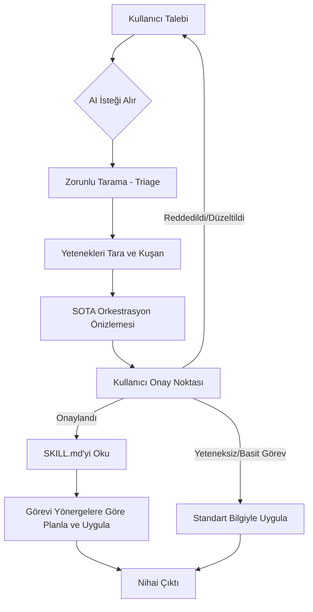

# Akıllı Orkestratör: Otonom Yetenek Yönlendirmesi (Auto-Mechanism)

[](https://opensource.org/licenses/MIT)
[](http://makeapullrequest.com)


Yapay zeka destekli geliştirme süreçleri için **Akıllı Orkestratör (Smart Orchestrator)** desenine hoş geldiniz. Bu proje, standart yapay zeka kodlama asistanlarını (Claude, Antigravity, Cursor vb.) kullanıcının komutuna göre otomatik olarak özelleştirilmiş yetenekleri (skilleri) seçen, yükleyen ve uygulayan **"Akıllı Orkestratörlere"** dönüştürmek için yapısal bir metodoloji tanımlar.

## 🚀 Problem

Modern yapay zeka asistanları; UI/UX en iyi uygulamaları, gelişmiş veritabanı mimarileri, E2E test rehberleri gibi güçlü, özelleşmiş araçlara (yeteneklere/skills) ve dokümantasyonlara erişim imkanına sahiptir. Ancak, kullanıcıların genellikle yapay zekaya bu belirli araçları kullanması için manuel olarak talimat vermesi gerekir. Açık bir talimat verilmediğinde, yapay zeka jenerik kod üretimine geri döner ve bu da optimal olmayan, standart dışı sonuçlara yol açar.

## 💡 Çözüm: Auto-Mekanizma

**Auto-Mekanizma (Skill Triage)**, sistem istemine (ör. `AGENTS.md`, `GEMINI.md`) enjekte edilen zorunlu bir protokoldür. Bu protokol, yapay zekayı kod yazmadan önce durmaya ve arka planda talep üzerinde bir analiz yapmaya zorlar.

### Temel Prensipler

1. **Zorunlu Tarama (Mandatory Triage):** Karmaşık bir prompt (talep) alındığında asla doğrudan kod yazmaya veya plan yapmaya başlama.
2. **Yetenek Kuşanma (Equip Skills):** Mevcut `<skills>` (yetenekler) havuzunu tara. Göreve en uygun 1-3 spesifik yeteneği (ör. `ui-ux-pro-max`, `postgres-patterns`) belirle.
3. **Okuma ve Uygulama (Read & Execute):** Seçilen yetenekler için `SKILL.md` dosyalarını otonom olarak (dosya okuma araçlarıyla) oku ve o dosyadaki endüstri standartlarını, yönergeleri çözüme kesinlikle uygula.
4. **Şeffaf SOTA Orkestrasyon Önizlemesi:** Kritik veya karmaşık görevler için risk, yetenekler, etki alanı haritası, proaktif öneriler ve teknik olarak zenginleştirilmiş bir istek içeren şeffaf bir ön rapor oluştur ve planlama/yürütme öncesinde kullanıcıdan açık onay al.

### Mimari Akış (Architecture Flow)



## 🧠 Arka Planda Nasıl Çalışır?

Akıllı Orkestratör, talimat şişkinliğini (instruction bloat) önleyen ve yüksek kaliteli çıktılar sağlayan, son derece verimli, olay güdümlü (event-driven) bir otonom iş akışı uygular:

1. **Analiz ve Sınıflandırma (RFC Aşaması):** Kullanıcı bir prompt gönderdiğinde yapay zeka durur. Talebin basit bir düzeltme (trivial) mi yoksa planlama gerektiren karmaşık bir işlem mi olduğunu belirlemek için ayrıştırma yapar.
2. **Dinamik Bağlam Budama (Dynamic Context Pruning):** Tüm mühendislik talimatlarını sistem promptuna yükleyip modelin dikkatini dağıtmak ve token israf etmek yerine, yapay zeka `.skills/*/SKILL.md` metadata'sını tarar ve dinamik olarak *yalnızca* o görev için gerekli olan uzmanlık kılavuzlarını okur.
3. **Değişim Çapı Mavi Kopyası (Blast Radius Blueprinting):** Yapay zeka tüm kod tabanındaki (API, UI, Database) yapısal değişiklikleri diyagrama döker, risk seviyelerini (Düşük/Orta/Yüksek) belirler ve olası bir hata anında uygulanacak geri dönüş planını hazırlar.
4. **HITL (Human-in-the-Loop) Kapısı:** Yapay zeka bu planı geliştiriciye bir "SOTA Orkestrasyon Önizlemesi" olarak sunar. Geliştirici onay vermeden kodlama aşamasına başlanmaz.
5. **Yürütme ve Öz-Gelişim (Lessons Loop):** Yapay zeka değişiklikleri uygular. Bir hata yaparsa veya kullanıcıdan bir düzeltme alırsa, gelecekte aynı hatayı tekrarlamamak için bu örüntüyü otonom olarak `tasks/lessons.md` dosyasına kaydeder.

---

## 💎 Temel Faydalar

*   **⚡ %90 Bağlam Token Tasarrufu:** İlgisiz talimatların dinamik olarak budanması, bağlam penceresini hafif, son derece odaklanmış ve hızlı tutar.
*   **🛡️ Asimetrik Risk Azaltma:** **Değişim Çapı Haritalandırması (Blast Radius Mapping)** ve **Geri Dönüş Planı (Rollback Plan)** sayesinde tek bir satır kod yazılmadan önce canlı ortam çökmeleri ve veri kayıpları engellenir.
*   **🎨 Varsayılan Olarak Kıdemli Seviye Estetik:** Yapay zekayı tembel tarayıcı varsayılanlarını atlamaya, HSL renk paletleri, mikro animasyonlar ve React hata sınırları (Error Boundaries) kullanmaya zorlar.
*   **💾 Sıfır Talimat Kaybı (Instruction Decay):** Sıfır bağımlılıklı yetenek linter'ı (`npm run lint:skills`) CI/CD hatlarına entegre edilerek ekibin yazdığı yetenek standartlarının her zaman kusursuz kalmasını sağlar.

---

## 🎬 Gerçek Dünya Vaka Analizleri (Öncesi vs. Sonrası)

### 📊 Örnek 1: Frontend Bileşen Geliştirme

#### 1. 🛑 Yalın Kullanıcı Talebi
> "Responsive bir sepet kartı bileşeni yap."

#### 2. ❌ Akıllı Orkestratör OLMADAN Çıktı
Yapay zeka anında jenerik, düz bir HTML ve CSS parçası yazar. Tarayıcı varsayılan görselleri, loading skeletondan yoksun tasarımları ve hata sınırları bulunmayan bir React kodu sunar. Sıkıcıdır, basittir ve veri eksikliğinde arayüzü patlatır.

#### 3. 🎯 Akıllı Orkestratör İLE SOTA Orkestrasyon Önizlemesi
```markdown
### 🔍 Auto-Mechanism & Skill Triage Raporu

#### 🚦 Risk ve Güven Analizi (Risk & Confidence Score)
*   **Risk Derecesi:** Düşük
*   **Gerekçe:** Sadece UI katmanı ve bağımsız React bileşen düzenlemesi içeriyor.
*   **Geri Dönüş Planı:** Değişiklikler geri alınabilir, `src/components/ProductCard.tsx` yedeğine dönülebilir.

#### 🛡️ 1. Kuşanılan Yetenekler (Equipped Skills)
- `frontend-ui-ux-pro` (Premium tipografi, glassmorphism UI, duyarlı ızgaralar).

#### 🗺️ 2. Etki Alanı ve Kod Değişim Çapı (Blast Radius Map)
| Etkilenen Katman | Dosya / Tablo Yolu | Etki Türü | Potansiyel Yan Etki (Side Effects) |
| :--- | :--- | :--- | :--- |
| **Frontend UI** | `src/components/ProductCard.tsx` | Yeni | Yok (Yalıtılmış yeni bileşen) |

#### 📝 3. Aktif Mimari Kurallar (Active Architectural Rules)
- **Frontend Performans (Kural 13):** `next/image` yerine Cloudflare CDN proxy destekli `CustomImage.tsx` kullanılmalı.
- **UI İzolasyonu (Kural 13):** Yükleme iskeleti (loading skeleton) ve React Error Boundary entegre edilmeli.

#### 🚀 4. Proaktif / Katma Değer Önerileri (Bonus Value-Adds)
- **Estetik:** Hover durumunda 4px'lik bir `backdrop-filter: blur(10px)` glassmorphism efekti ve yumuşak mikro animasyonlar (micro-animations) ekleyelim.

#### 🧠 5. Gelişmiş Orkestre Edilmiş Teknik İstek (Advanced Orchestrated Prompt)
- `CustomImage` entegrasyonuna sahip, yükleme iskeletli, iyimser durum güncellemeli (optimistic updates) ve React Error Boundary ile sarmalanmış, Tailwind HSL renk değişkenlerini ve 8pt boşluk sistemini kullanan premium bir React kart bileşeni oluştur.
```

#### 4. ✨ Sonuç Çıktısı (Premium Kıdemli Seviye UI)
Yapay zeka; tembel varsayılanları atlayıp gecikmeli yükleme iskeletine sahip, Cloudflare CDN optimizasyonlu ve yumuşak Framer Motion mikro animasyonları barındıran göz alıcı bir glassmorphic React bileşeni üretir:
```tsx
import React from 'react';
import { CustomImage } from './CustomImage'; // CDN Optimize edilmiş
import { motion } from 'framer-motion';

export const ProductCard = ({ product }) => {
  return (
    <motion.div 
      whileHover={{ scale: 1.02 }}
      className="bg-white/10 backdrop-blur-md border border-white/20 rounded-2xl p-4 shadow-xl shrink-0"
    >
      <div className="relative overflow-hidden rounded-xl aspect-square">
        <CustomImage src={product.image} alt={product.name} fill className="object-cover" />
      </div>
      <h3 className="font-outfit text-white text-lg mt-3 font-semibold">{product.name}</h3>
      <p className="text-white/60 text-sm mt-1">{product.description}</p>
      <div className="flex items-center justify-between mt-4">
        <span className="font-bold text-white text-xl">${product.price}</span>
        <button className="bg-gradient-to-r from-purple-500 to-indigo-600 hover:shadow-purple-500/20 text-white font-medium px-4 py-2 rounded-lg transition-all duration-300">
          Sepete Ekle
        </button>
      </div>
    </motion.div>
  );
};
```

---

### 🗄️ Örnek 2: Veritabanı Şeması ve Geçişi (Database Schema & Migration)

#### 1. 🛑 Yalın Kullanıcı Talebi
> "Kullanıcı şemamıza cüzdan bakiyesi (wallet balance) ekle."

#### 2. ❌ Akıllı Orkestratör OLMADAN Çıktı
Yapay zeka körü körüne Prisma şemasını değiştirir, yeni alanı default değeri olmadan zorunlu (required) hale getirir ve doğrudan migration çalıştırır. Canlıya çıkıldığında, **veritabanı kilitlenir (locks)** ve mevcut kullanıcı satırlarında varsayılan bakiye olmadığı için site çöker.

#### 3. 🎯 Akıllı Orkestratör İLE SOTA Orkestrasyon Önizlemesi
```markdown
### 🔍 Auto-Mechanism & Skill Triage Raporu

#### 🚦 Risk ve Güven Analizi (Risk & Confidence Score)
*   **Risk Derecesi:** Yüksek
*   **Gerekçe:** Veritabanı şema değişikliği içeriyor, canlı ortamda veri kaybına veya tablo kilitlenmesine (table locks) yol açabilir.
*   **Geri Dönüş Planı:** Değişiklik öncesi `pnpm db:backup` ile Postgres dump alınacak, hata anında veritabanı rollback edilip schema geri yüklenecek.

#### 🛡️ 1. Kuşanılan Yetenekler (Equipped Skills)
- `backend-clean-architecture` (Sıfır kesinti süresi, migration güvenliği, ORM desenleri).

#### 🗺️ 2. Etki Alanı ve Kod Değişim Çapı (Blast Radius Map)
| Etkilenen Katman | Dosya / Tablo Yolu | Etki Türü | Potansiyel Yan Etki (Side Effects) |
| :--- | :--- | :--- | :--- |
| **Database** | `prisma/schema.prisma` | Değiştir | Canlıda var olan satırlar için veri uyumsuzluğu oluşabilir. |
| **Backend API** | `user.service.js` | Değiştir | Wallet alanlarının null kontrolüne tabii tutulması gerekir. |

#### 📝 3. Aktif Mimari Kurallar (Active Architectural Rules)
- **Veritabanı Şeması (Kural 4):** Geriye dönük uyumluluğu bozan yıkıcı değişiklikler yasaktır. Alan Nullable tanımlanmalı veya default değer (0) verilerek eklenmelidir.
- **Database Backup (Kural 10):** Migrate komutunu çalıştırmadan önce root dizinde `pnpm db:backup` alınması zorunludur.

#### 🚀 4. Proaktif / Katma Değer Önerileri (Bonus Value-Adds)
- Cüzdan bakiyesi kuruş bazlı hesaplanmalıdır. Hassasiyet kayıplarını engellemek için float/double yerine veritabanında `Decimal` veya `Int` (kuruş/cents cinsinden) saklanmasını öneriyoruz.

#### 🧠 5. Gelişmiş Orkestre Edilmiş Teknik İstek (Advanced Orchestrated Prompt)
- Prisma şemasına `User` modeli için `balance` alanını Int (kuruş bazlı) olarak, varsayılan değeri 0 olacak şekilde (default: 0) güvenli olarak ekle. `pnpm db:backup` yedek alma ve sıfır kesinti süreli (zero-downtime) migration adımlarını sırayla işlet.
```

#### 4. ✨ Sonuç Çıktısı (Kusursuz ve Güvenli Veritabanı Geçişi)
Yapay zeka; kullanıcıyı güvenli bir veritabanı yedeği almaya yönlendirir, yeni alanı tamamen geriye dönük uyumlu olacak şekilde ekler, migration betiklerini oluşturur ve hiçbir kesinti süresi veya kilitlenme riski yaratmadan ORM katmanlarını günceller:
```prisma
// packages/database/prisma/schema.prisma
model User {
  id        String   @id @default(uuid())
  email     String   @unique
  name      String?
  // Mevcut satırlarda null hatalarını önlemek için varsayılan 0 (kuruş) değeri ile güvenle eklendi
  balance   Int      @default(0) 
  createdAt DateTime @default(now())
  updatedAt DateTime @updatedAt
}
```

---

## 📚 Standart Kütüphane (Standard Library) Dahildir

`smart-orchestrator` deposunu herhangi bir sektörde anında kullanışlı hale getirmek için, kapsamlı bir `SKILL.md` örnekleri "Standart Kütüphanesi" ekledik. Bunlar, çeşitli endüstriler için en iyi uygulamaları (best practices) ve standartları kapsar:

- **🎨 Frontend & UI/UX** (`examples/frontend-ui-ux-pro`)
- **⚙️ Backend Clean Architecture** (`examples/backend-clean-architecture`)
- **🛡️ Siber Güvenlik (OWASP)** (`examples/security-owasp-top10`)
- **☁️ DevOps & Cloud** (`examples/devops-cloud-architect`)
- **📊 Veri Bilimi & ML** (`examples/data-science-and-ml`)
- **🧪 QA & E2E Test** (`examples/qa-e2e-testing`)
- **📱 Mobil Geliştirme** (`examples/mobile-first-patterns`)

Yapay zekanızın uzmanlık seviyesini anında yükseltmek için bu şablonlardan herhangi birini kopyalayıp kendi projenizin `.skills/` veya `skills/` dizinine yapıştırabilirsiniz.

## ⚡ İnteraktif CLI & Yetenek Linter'ı (2.3 ile Yeni)

Smart Orchestrator 2.3, yapısal disiplini korumak için sıfır bağımlılıklı (zero-dependency) interaktif/sessiz kurulum sihirbazı ve CI/CD linter'ı içerir.

### 1. İnteraktif & Sessiz CLI Sihirbazı
Triage davranış modelini projenizin teknik yığınına, dil tercihine ve hedef AI IDE'lerinize göre anında başlatın ve özelleştirin:
```bash
# Doğrudan GitHub üzerinden interaktif kurulumu çalıştırın (Sıfır kurulum gecikmesi)
npx -y github:ahmetbolu/smart-orchestrator init

# Veya optimum akıllı varsayılanlarla 1 saniyede sessiz kurulum yapın (Sessiz Mod)
npx -y github:ahmetbolu/smart-orchestrator init -y
```

#### Öne Çıkan 2.3 CLI Yetenekleri

* **🌍 Çoklu Dil Desteği:** Yapay zeka kurallarını dinamik olarak **İngilizce** veya **Türkçe** olarak oluşturur.
* **🎯 Çoklu IDE Entegrasyonu:** Kullandığınız araçlara uygun kural dosyalarını tek seferde oluşturur:
  * `AGENTS.md` (Ortak bilişsel kurallar)
  * `.cursorrules` (Cursor IDE için tam yapılandırılmış dosya)
  * `.windsurfrules` (Windsurf IDE için tam yapılandırılmış dosya)
  * `CLAUDE.md` (Claude Code CLI için tam yapılandırılmış kurallar)
  * `.vscode/settings.json` (Custom Copilot chat yönergeleri entegrasyonu)
* **📚 Standart Kütüphane Kurulumu:** 8 premium endüstri standardı yetenek şablonunu (`frontend-ui-ux-pro`, `backend-clean-architecture` vb.) seçmeli veya toplu olarak doğrudan `.skills/` klasörünüze kopyalar.
* **🔄 Otonom Destek Şablonları:**
  * Hata öğrenme döngüsü için `tasks/lessons.md` dosyasını otomatik olarak oluşturur.
  * Bilişsel mimari haritası için `docs/architecture/MAP.md` şablonunu otomatik olarak oluşturur.

### 2. CI/CD Yetenek Linter'ı (Skill Linter)
Tüm `.skills/*/SKILL.md` dokümanlarında biçimlendirme disiplinini koruyun. Linter, YAML frontmatter formatını, açıklama yeterliliğini ve yapısal başlıkları (H1/H2) doğrular.
```bash
# Yerel yetenekler klasörünüzü tarayın
pnpm run lint:skills
# veya
node bin/lint.js
```
Yeteneklerinizin zamanla işlevselliğini yitirmesini (instruction decay) önlemek için otomatik CI/CD kontrollerine eklemek için mükemmeldir.

## 🛠 Entegrasyon Rehberi

Bu yapıyı kendi yapay zeka destekli projelerinize entegre etmek için aşağıdaki protokolü ana AI talimat dosyanıza (ör. `CLAUDE.md`, `AGENTS.md` veya `cursorrules`) eklemeniz yeterlidir:

```markdown
## Otonom Yetenek Yönlendirmesi (Auto-Mechanism & Skill Triage 2.2)
Bu proje kapsamında AI asistanları salt "kod yazıcı" değil, aynı zamanda **"Akıllı Orkestratör"** olarak davranmak zorundadır.
1. **Zorunlu Taramalar (Mandatory Triage):** Kullanıcıdan yeni, karmaşık veya belirsiz bir talep (prompt) geldiğinde, DOĞRUDAN kod yazmaya veya plan yapmaya BAŞLAMAYIN.
2. **Yetenek Kuşanma ve Dinamik Bağlam Budama:** Önce sistemdeki `.skills/` listesini tarayın. İstenen göreve en uygun yetenekleri belirleyin. Bağlam penceresini verimli tutmak için sadece hedeflenen göreve doğrudan etki eden yeteneklerin `SKILL.md` dosyalarını okuyun.
3. **Okuma ve Uygulama:** Belirlenen yeteneklerin `SKILL.md` dosyalarını okuyun ve görevi, oradaki en iyi endüstri standartlarına, yönergelere ve best-practice'lere tam sadık kalarak gerçekleştirin. Bu adım atlanamaz.
4. **Şeffaf Triage ve SOTA Orkestrasyon Önizlemesi (Triage & Orchestration Preview):** *Kritik, karmaşık veya belirsiz her türlü görevde plan veya kod aşamasına geçmeden önce*, kullanıcıya orkestrasyonun nasıl yapılacağını gösteren aşağıdaki şablona sahip şeffaf bir önizleme raporu sunmak **ZORUNLUDUR**:
   - **Risk ve Güven Analizi (Risk & Confidence Scoring):** Görevin risk derecesi (Düşük/Orta/Yüksek), gerekçesi ve hata durumunda uygulanacak **Geri Dönüş Planı (Rollback Planı)**.
   - **Kuşanılan Yetenekler (Equipped Skills):** Görev için seçilen özel `<skills>` listesi ve kullanım gerekçeleri.
   - **Etki Alanı ve Kod Değişim Haritası (Blast Radius Mapping):** Değişiklikten etkilenecek katmanlar (Database, API Backend, Frontend UI vb.), dosya yolları ve potansiyel yan etkileri gösteren bir tablo.
   - **Aktif Mimari Kurallar (Active Architectural Rules):** Görevi doğrudan etkileyen `AGENTS.md` / `GEMINI.md` kuralları.
   - **Proaktif / Katma Değer Önerileri (Proactive / Value-Add Recommendations):** Kullanıcının istemeyi unuttuğu ancak e-ticaret standartlarında olması gereken güvenlik, performans veya ölçeklenebirliği artıran bonus öneriler.
   - **Gelişmiş Orkestre Edilmiş Teknik İstek (Advanced Orchestrated Prompt):** Kullanıcının düz promptunun, mimari standartlar, girdi/çıktı kontratları ve E2E test senaryoları ile zenginleştirilmiş, teknik ayrıntıları netleştirilmiş gelişmiş hali.
   - **Onay İstemi (Approval Checkpoint):** Kullanıcıdan bu orkestrasyon çerçevesini onaylamasını isteyin. Kullanıcı onay verirse plan/yürütme aşamasına geçin. Bu checkpoint kesinlikle atlanamaz.
5. **Öz-Gelişim ve Ders Döngüsü (Lessons Loop):**
   - Hata desenlerini ve coding kısıtlarını öğrenmek için her göreve başlamadan önce `tasks/lessons.md` dosyasını kontrol edin.
   - Hata çözümlerinden veya kullanıcı düzeltmelerinden hemen sonra hata modellerini `tasks/lessons.md` dosyasına otonom olarak kaydedin.
6. **Yetenek Doğrulama (CI/CD Linter):**
   - `.skills/` altındaki tüm yeteneklerin yapısal standartlara uygunluğunu `pnpm run lint:skills` (veya `npm run lint:skills`) ile doğrulayın.
7. **TDD & Spec-First Workflow:** Kod yazmadan önce test ve spesifikasyon dosyalarını oluşturmayı ve TDD yaşam döngüsünü kesinlikle takip etmeyi zorunlu kılar.
8. **Bilişsel Mimari Haritası (Cognitive Architectural Anchor):** Projedeki klasör yapısı, durum yönetimi, event kuyrukları ve yönlendirme kurallarını `docs/architecture/MAP.md` üzerindeki tek doğruluk kaynağı ile hizalar.
```

## 🌟 Örnek İş Akışı

1. **Kullanıcı İsteği:** "Yeni bir kullanıcı profili sayfası yap."
2. **Yapay Zeka Hareketi (Arka Plan):**
   - *Tarama (Triage):* "Bu bir arayüz görevi. Tasarım standartlarına ihtiyacım var."
   - *Kuşanma (Equip):* `ui-ux-pro-max` yeteneğini seçer.
   - *SOTA Orkestrasyon Önizlemesi:* Risk (Düşük), kuşanılan yetenekler (`ui-ux-pro-max`), etki alanı haritası, mimari kurallar, katma değer önerileri ve zenginleştirilmiş teknik istek içeren önizleme raporunu oluşturur.
   - *Onay İstemi:* Kullanıcıdan onay ister. Kullanıcı "Onaylıyorum, devam et" yanıtını verir.
   - *Okuma (Read):* Boşluklar, tipografi ve duyarlı (responsive) ızgara kuralları için `ui-ux-pro-max/SKILL.md` dosyasını okur.
3. **Yapay Zeka Çıktısı:** Kullanıcının tasarım kurallarını manuel olarak belirtmesine gerek kalmadan, endüstri standartlarına uygun, kusursuz şekilde stillendirilmiş bir React bileşeni sunar.

## 📄 Lisans

Bu konsept ve dokümantasyon MIT Lisansı altında açık kaynak olarak sunulmuştur.

## 🤝 Topluluk Katkıları

Açık kaynak topluluğunun gücüne inanıyoruz! Belirli bir niş için (ör. Web3, Oyun Geliştirme, Gömülü Sistemler) güçlü bir `SKILL.md` oluşturduysanız, bunu Standart Kütüphaneye eklemekten memnuniyet duyarız.

1. Repoyu fork'layın.
2. `examples/` içinde kendi yetenek klasörünüzü oluşturun.
3. Bir Pull Request gönderin.

Daha fazla detay için [Katkıda Bulunma Rehberimize](CONTRIBUTING.md) göz atın.
